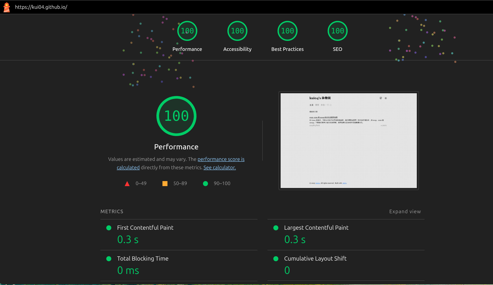

# Kui04 的杂物间

使用 Astro 搭建的一个静态博客，样式方案采用 tailwindcss，没有使用其他框架，背景使用 WebGL 配合 [regel](https://github.com/regl-project/regl/) 编写，shader 参考了[snowfall](https://codepen.io/bsehovac/full/GPwXxq)，移植到了 regl 上，并把风场改的自然一点。尽可能的优化性能和体验，如：防止主题闪烁，加快首屏渲染速度，提前获取文章内容，延迟不必要资源加载，预留滚动条位置防止布局抖动。

